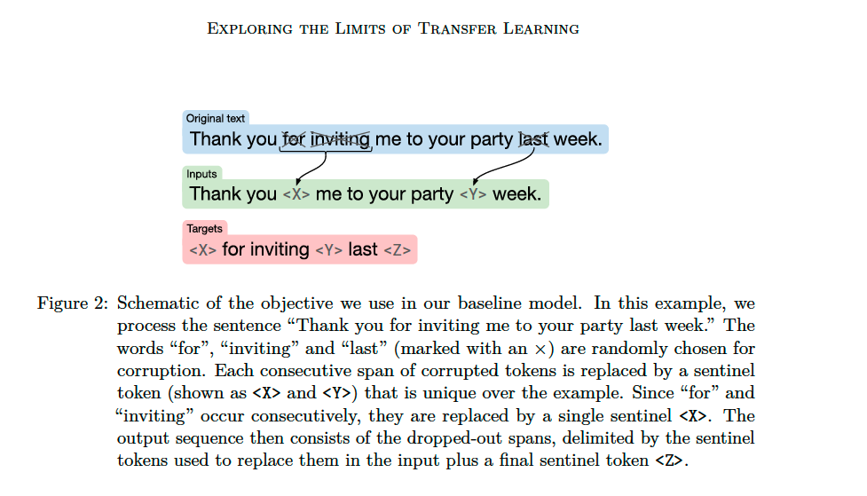

- Some important points from the main T5 paper: _Exploring the Limits of Transfer Learning with a Unified Text-to-Text Transformer_ by Raffel et al. (2020), https://arxiv.org/pdf/1910.10683.pdf
    - T5 = "Text-to-Text Transfer Transformer"
    - Based on Transfer Learning as main approach, i.e. first pre-train a model on a data rich task and then fine tune it on a downstream task
    - Idea underlying the main work: Treat every text processing problem as a "text-to-text" problem, i.e. taking text as input and producing new text as output
    - -> Allows to compare the effectiveness of different transfer learning objectives
    - Downstream Tasks benchmarked in this paper: Sentiment Analysis, Natural Language Inference, Sentence Completion, Question answering etc.
    - model architecture is based on a standard encoder-decoder Transformer as proposed by Vaswani et al. (2017)
    - Pre-training: 524.288 training steps per model on C4 dataset before fine-tuning
    - Fine-Tuning: 262.144 steps on all task.
    - Denoising objective or Masked Language Modeling used to predict missing or otherwise corrupted tokens in the input.
    - "Word dropout" regularization technique: randomly sample and drop out X percent of tokens in the input sequence.  
    - 
